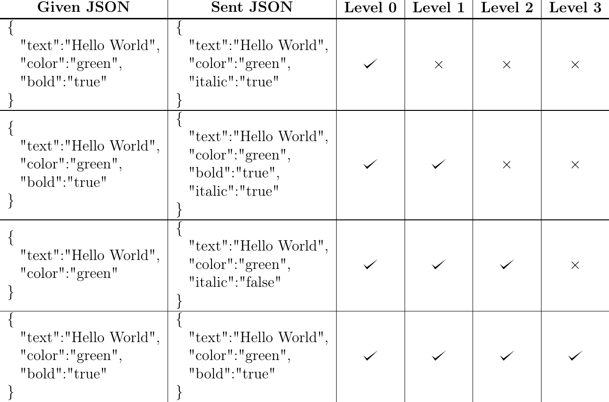

# English tutorial

## Overview

1. [General](#general)
2. [Commands](#commands)
3. [Config](#config)
    - [Miscellaneous](#miscellaneous)
	- [Presets](#presets)
		+ [Idle timeout](#idletimeout)
		+ [Gamemode change](#gamemodechange)
		+ [Only self commands](#onlyselfcommands)
		+ [Console commands](#consolecommands)
	- [Custom filters](#custom-filters)
	  - [Commands](#filter-commands)
	  - [JsonPrecisionLevel examples](#jsonprecisionlevel-examples)
	  - [Examples](#examples)
	- [Additional information](#additional-information)
	- [1.16+](#1.16+)

## General

First of all: Thank you for using this plugin and reading this tutorial!  
A few information in advance:

- In general, if you want to send me anything, please create an issue here. Please get in touch in the following cases:
	- If you want to translate this tutorial into another language, which would be very cool! 
		However, I don't think the plugin needs to be translated, since it has very few messages.
	- If you have any suggestions on how to improve this guide.
	- If you experience errors, have questions or general suggestions for improvement.
- This plugin collects anonymous server stats with [bStats](https://bstats.org), an open-source statistics service for Minecraft software. If you don't want this, you can deactivate it in `plugins/bStats/config.yml`.

Now a few more infos regarding the plugin:

- With this plugin you can hide certain messages from players. There are [Presets](#presets), but you can also create custom filters. I recommend reading this tutorial previously so that you don't accidentally deactivate all messages.
- You cannot hide messages from the console.
- If you receive a multiline message, unfortunately you can't hide them together, you have to create multiple filters. This is the case, for example, if you enter a Vanilla command incorrectly.

## Commands

This plugin has only one command: `/messagehider` (Alias: `/mh`)

### Sub commands

Permissions are marked **bold**.

- `/messagehider reload` - Reloads the config.
  - **messagehider.reload**
- `/messagehider log <start|stop>` - Starts or stops logging of messages you receive. This is useful if you want to create new filters but don't know exactly what the message (in JSON) looks like.  
	The log is saved at `plugins/MessageHider/logs/PLAYERNAME.log` and will be deleted if you start logging again. Of course you can also delete the log manually.  
	Filtered messages will be logged, too.
	- **messagehider.log**
- `/messagehider create` - Creates an empty new filter. This is useful so that you do not forget to configure something.
  - **messagehider.create**
- `/messagehider createcommand <Filter>` - Creates an empty [command](#filter-commands) for a filter.
  - **messagehider.createcommand**
- `/messagehider check <json|plain> <Filter ids> <Message>` - With this sub command you can check whether a message would be hidden. For this you can provide whether you state a JSON or a plain message and the ids of the filters with which the plugin should check the message. If you want the message to pass through all filters, specify a hyphen. Please note that the plugin does not check the receivers and senders in this process because it would be illogical.
  - **messagehider.check**
- `/messagehider run <Filter ids> [Player] [Sender]` - Executes filter commands manually. Filter ids can be separated by commas. The first player specified would be, so to speak, if the filter is executed regularly, the one who gets the message and the second player would be the one who sent the message. If the first player is not specified, the player who executed the command is assumed, and if the second is not specified, the console is assumed. If the command is executed from the console, the first player must be specified.
  - **messagehider.run**

## Config

The config is located at `plugins/MessageHider/config.yml`.
When the config is generated for the first time, it looks like this:

```yml
checkForUpdates: true
messageFilters: [
  ]
prefix: '&8[&cMH&8] '
presets:
  consoleCommands: false
  gamemodeChange: false
  idleTimeout: false
  onlySelfCommands: false
```

### Miscellaneous

- `checkForUpdates` - If enabled the plugins checks for updates every time it's loaded or an operator joins the game. If it's not up to date a message will be sent to the console or the player respectively.
- `prefix` - The prefix of the plugin, precedes all messages.  
For example: *[MH] The config was reloaded.*

### Presets

If you only need the presets, you don't need to worry about `messageFilters`.  
To enable the presets, you can simply change the `false` to a `true` for the respective preset.

#### `idleTimeout`

If this preset is enabled,Allgemein you will no longer see messages like  
*\[Server: The player idle timeout is now X minutes\]*  
If you change the idle timeout by yourself you will receive the feedback message, but not if the server (the console) or another player changes it. This is extremely useful if you play on a hosting provider like [PloudOS](https://ploudos.com) and don't always want to get this message there.

#### `gamemodeChange`

If this preset is enabled, you will no longer receive the messages when other players change their game mode.

#### `onlySelfCommands`

If this preset is enabled, you only receive feedback messages from your own commands. (1.16+)

#### `consoleCommands`

If this preset is enabled, operators will no longer receive messages from commands sent from the console. (1.16+)

### Custom filters

If the preset options are not enough, you can create your own filters. The best way to do this is to start with `/messagehider create`, which will create an empty filter.

There are the following settings: (They are sorted differently here than in the config, because it is alphabetical in the config)

- `id (Text)` - The id of the filter. This is only used for `/messagehider check` and `/messagehider run`, if you don’t need it you can just leave it at `null`. You can use the same id for multiple filters but it is not recommended. Only letters, numbers and underscores may be used for the id.

- `onlyHideForOtherPlayers (true/false)` - If enabled, messages you have sent yourself will not be filtered for you. (1.16+)

- `onlyExecuteCommands (true/false)` - If enabled, only the commands are executed and the message won’t be hidden or replaced. Furthermore, other filters will be applied if this is enabled and this filter matches.

- `stopAfter (true/false)` - If enabled, the message will not be hidden or replaced, only the commands will be executed. Also, other filters are applied if this is enabled and the filter matches.

- `priority (number/null)` - The priority according to which the filters will be applied. The lower the priority of a filter, the earlier it will be executed. By default, the priority is `null`, in which case the filter is executed last. The priority is only really important when messages are replaced, because then it depends on which filter replaces the message first.

- `commands (List)` - A list of commands that are executed when the filter matches.

   - `command` - The command that will be executed.
   - `type` - Either `CONSOLE` or `PLAYER`, depending on whether the command is to be executed by the console or by the player.
   - `delay` - The delay in seconds after which the command is to be executed. Decimal numbers are possible.

   For more information, see [below](#filter-commands).

- `message`

   - `text (text)` - The message to filter for. If JSON is enabled, in JSON format. If the filter is only to be executed via `/messagehider run`, `null` can be specified.

   - `replacement (text)` - The text to replace the message with if the filter matches. The text can be specified as JSON or as normal text. Also you can use colors with & characters. If `regex` is enabled, `$1`, `$2` and `$n` can be used to access the first, second and `n`th group of the pattern. If `null` is specified as replacement (default), the message will be hidden as normal and not replaced. If another filter would have hidden the message before, the message will still be replaced, but after the message has been replaced once, it will not be changed further.

   - `ignoreCase (true/false)` - If enabled, case is ignored when filtering. If JSON is enabled, this counts applies for the values, not for the keys.

   - `regex (true/false)` - If enabled, the plain message or JSON values are inspected according to regex. A guide to regex is available at [RegExr](https://regexr.com/). Note: Punctuation characters like dots are interpreted differently when regex is enabled. You can prevent this with a `\` in front of it. More info on RegExr. Here are a few examples:

      - `.*Hello.*` - All messages that contain `Hello`. `.*` represents a any count of any character.
      - `The dice result is [1-6]\.` - `[1-6]` represents a number from 1 to 6. The period is preceded with a `\` because the period would represent any character otherwise.
      - `(\w{3,16}) (joined|left) the game` - `\w{3,16}` represents a letter sequence that is 3 to 16 characters long (Minecraft player names). Because it’s preceded and followed by parentheses, it can be called later again as a group (with `$1`), as mentioned above for `replacement`.  
         `joined|left` represents either `joined` or `left`. There are parentheses here because we either want `joined` or `left` but not either `(\w{3,16}) joined` or `left the game`. Of course it could be called with `$2` either way.

   - `json`  
      If working with JSON, I would always recommend using `/messagehider log`, otherwise you might assume something that is not so in the actual message, as e.g. Spigot sends messages from plugins in a weird format.

      - `enabled (true/false)` - If enabled, the specified filter message is interpreted as JSON. If not, it will be interpreted as a plain message, which can also be a language message from Minecraft. (e.g.: `commands.setidletimeout.success`)

      - `jsonPrecisionLevel (numbers)` - Only if JSON enabled, numbers:

         + `0`: Only the keywords that exist on both sides (in the specified message and in the message that was sent) will be inspected.  
         + `1`: Only the keywords that exist on the left side (specified message) will be inspected. If a keyword exists on the left side, but not on the right side (sent message), the filter will not match.
         + `2`: All keywords will be inspected, but keywords that exist on the right side but are `false` will be ignored.
         + `3`: All keywords will beinspected without exception.

         If a key on the left side should be ignored, `<ignore>` can be specified as value.  
         [Examples](#jsonprecisionlevel-examples) are below.

- `targets`  
   For this settings either the player name, the UUID or `<console` can be specified. The lists will be ignored when they are left empty and only count if you fill in one or more player names or respectively the console.

   - `senders (list)` - Only messages sent by the given players or the console will be filtered with this filter. (1.16+)  
      `excludedSenders (list)` - From anyone given, sent messages will **not** be filtered with this filter. (1.16+)  
      `receivers (list)` - The message will be filtered only for the given players.
      `excludedReceivers (list)` - The message will not be filtered for anyone given.

#### Filter commands

Since the commands should also depend on player and message, there are certain things that can be replaced there. These placeholders are provided by the plugin:

- `%mh_player_sender_name%` - The name of the player who sent the message. `[CONSOLE]` if it was the console or the server. (1.16+)
- `%mh_player_sender_uuid%` - The uuid of the player who sent the message. `[CONSOLE]` if it was the console or the server. (1.16+)
- `%mh_player_receiver_name%` - The name of the player who received the message.
- `%mh_player_receiver_uuid%` - The uuid of the player who received the message.
- `%mh_message_sent_plain%` - The message that was sent, as plain text.
- `%mh_message_sent_json%` - The message that was sent, as JSON text.
- `%mh_message_replaced_plain%` - The replacement, as plain text. If the message was not replaced, it is the message that was sent.
- `%mh_message_replaced_json%` - The replacement, as JSON text. If the message was not replaced, it is the message that was sent. If the replacement was not specified as JSON, it’s the replacement as plain text.
- `%mh_regex_{Group}%` - A regex group. Only possible if Regex is activated for the filter. (Can only be used with the PlaceholderAPI)

*Without PlaceholderAPI*  
Even if the [PlaceholderAPI](https://www.spigotmc.org/resources/placeholderapi.6245/) is not installed, all placeholders provided by this plugin will work (Except `%mh_regex_{Group}%`)

*With PlaceholderAPI*  
If the [PlaceholderAPI](https://www.spigotmc.org/resources/placeholderapi.6245/) is installed, the placeholders mentioned above and placeholders provided by other extensions/plugins can be used in the commands.

**Example**:

```yaml
commands:
  - command: say Hi 
    type: PLAYER
    delay: 0.0
    # Executes "say Hi" fromt the player instantly.
  - command: setblock %mh_message_sent_plain% stone
    type: CONSOLE
    delay: 5.0
    # Sets a block after 5 seconds at the coordinates that formed the message.
  - command: kill %mh_player_sender_uuid%
   type: CONSOLE
   delay: 0.0
   # Kills the player that sent the message.
```

#### JsonPrecisionLevel examples



#### Examples

##### Preset: idle timeout (Version für 1.13+)

```yml
commands: [
]
id: idle_timeout
message:
  ignoreCase: false
  json:
    enabled: true
    jsonPrecisionLevel: 3
  regex: true
  replacement: null
  text: '{"italic": true, "color": "gray", "translate": "chat\\.type\\.admin", "with": [{"text": "Server"}, {"translate": "commands\\.setidletimeout\\.success", "with": ["\\d+"]}]}'
onlyExecuteCommands: false
onlyHideForOtherPlayers: false
priority: null
targets:
  excludedReceivers: [
  ]
  excludedSenders: [
  ]
  receivers: [
  ]
  senders: [
  ]
```

Explanation for `jsonPrecisionLevel`: It is `3` because this message is exactly like that.  
Explanation for `\\.`: Since regex is enabled here, we need to escape the period (Put a backslash in front of it). And since it is JSON, we need to escape the backslash again, so two backslashes.

##### Preset: gamemode change

```yml
commands: [
]
id: gamemode_change
message:
  ignoreCase: false
  json:
    enabled: true
    jsonPrecisionLevel: 1
  regex: true
  replacement: null
  text: '{"italic": true, "color": "gray", "translate": "chat\\.type\\.admin", "with": [{},{"translate": "commands\\.gamemode\\.success\\.\\w+"}]}'
onlyExecuteCommands: false
onlyHideForOtherPlayers: false
priority: null
targets:
  excludedReceivers: [
  ]
  excludedSenders: [
  ]
  receivers: [
  ]
  senders: [
  ]
```

Explanation for `jsonPrecisionLevel`: It is `1` because at `with` the first values of the array were given only as `{}`. Because it is `1`, what would actually be in there is ignored.

##### Preset: only self commands

```yml
commands: [
]
id: only_self_commands
message:
  ignoreCase: false
  json:
    enabled: true
    jsonPrecisionLevel: 1
  regex: true
  replacement: null
  text: '{"italic": true, "color": "gray", "translate": "chat\\.type\\.admin", "with": [{},{"translate": "commands\\.(\\w|\\.)+"}]}'
onlyExecuteCommands: false
onlyHideForOtherPlayers: false
priority: null
targets:
  excludedReceivers: [
  ]
  excludedSenders: [
  ]
  receivers: [
  ]
  senders: [
  ]
```

##### Preset: Console commands

```yml
commands: [
]
id: console_commands
message:
  ignoreCase: false
  json:
    enabled: true
    jsonPrecisionLevel: 1
  regex: true
  replacement: null
  text: '{"italic":true,"color":"gray","translate":"chat\\.type\\.admin","with":[{},{"translate":"commands\\.(\\w|\\.)+"}]}'
onlyExecuteCommands: false
onlyHideForOtherPlayers: false
priority: null
targets:
  excludedReceivers: [
  ]
  excludedSenders: [
  ]
  receivers: [
  ]
  senders: 
    - <console>
```

##### Example for targets

```yml
commands: [
]
id: beispiel
message:
  ignoreCase: false
  json:
    enabled: false
    jsonPrecisionLevel: 2
  regex: false
  replacement: null
  text: 'Hello :)'
onlyExecuteCommands: false
onlyHideForOtherPlayers: false
priority: null
targets:
  excludedReceivers:
    - Rapha149
    - Notch
  excludedSenders: [robabla, Notch]
  receivers:
    - 073b1315-85ff-49d8-8041-51627214dae0
    - b3884719-7b05-47c7-82db-656bdcd99050
  senders: 
    - robabla
    - 073b1315-85ff-49d8-8041-51627214dae0
    - <console>
```

Explanation:

- `excludedReceivers` - Here the Minecraft names of the players were given.
- `excludedSenders` - Here the players were written in square brackets instead of a YAML list with `-`. This can be done, but the plugin replaces it with the list with `-` when reloading the config.
- `receivers` - Here UUIDs were specified instead of player names.
- `senders` - Here it was shown that all three ways of specifying players can also be used together.

#### Additional information

- I recommend providing the UUIDs, because the plugin has to retrieve the UUIDs from the internet when names are used. This can slow down the reloading of the config or make the plugin unusable if, for some reason, the plugin cannot access the internet or the website [MC-Heads](https://www.mc-heads.net/).
- If the server's online mode is set to `false` (Cracked) the plugin will not validate UUIDs. If UUIDs are provided it will compare these, but if names are provided it will compare names with names.
- This example is not logical because `excludedReceivers` and `receivers` (also `excludedSenders` and `senders`) were provided. It is intended for example purposes only.

#### 1.16+

Some filters and functions like `senders` are only available for 1.16+. This is because from this version you can find out who sent a message.

**For plugin programmers**  
I do this via the `PacketPlayOutChat` packet. Only starting from the 1.16 there is the field `c` of the type `UUID`. If someone knows how to do this even in deeper versions, feel free to contact me!

## Final words

I hope this tutorial was understandable, otherwise, as I said, feel free to contact me via an issue.  
Enjoy the plugin :)