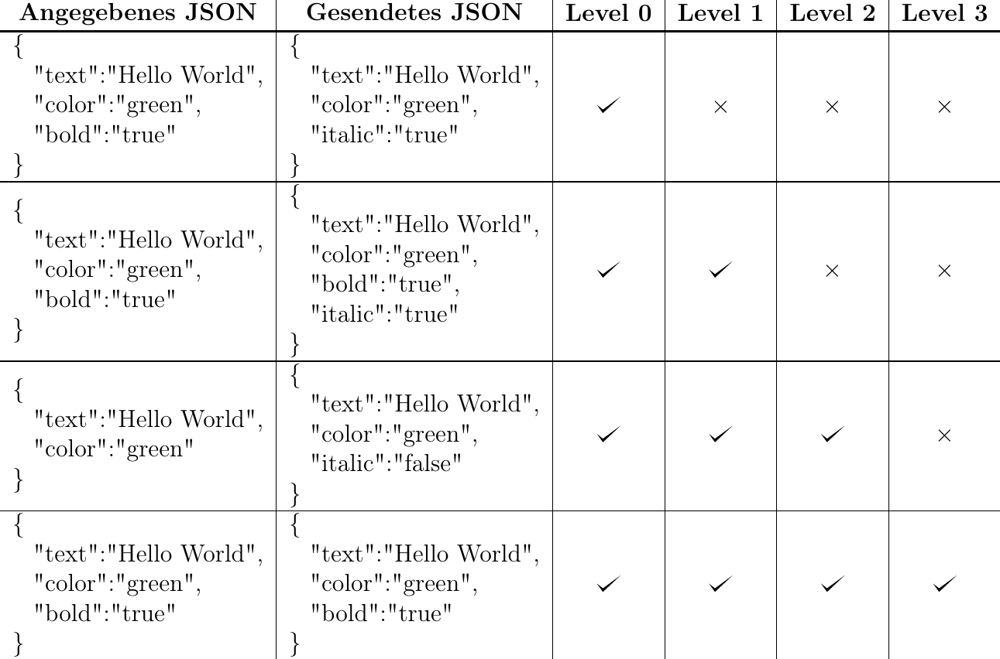

# German tutorial / Deutsche Erklärung

## Übersicht

1. [Allgemein](#allgemein)
2. [Befehle](#befehle)
3. [Konfiguration](#konfiguration)
    - [Verschiedenes](#verschiedenes)
    - [Voreinstellungen](#voreinstellungen)
        + [Inaktivitätslimit](#idletimeout)
        + [Spielmodus-Wechsel](#gamemodechange)
        + [Nur eigene Befehle](#onlyselfcommands)
        + [Konsolenbefehle](#consolecommands)
    - [Eigene Filter](#eigene-filter)
        - [Befehle](#filter-befehle)
        - [JsonPrecisionLevel Beispiele](#jsonprecisionlevel-beispiele)
        - [Beispiele](#beispiele)
    - [Weitere Infos](#weitere-infos)
    - [1.16+](#1.16+)

## Allgemein

Erst mal: Danke, dass du dieses Plugin nutzt und auch diese Anleitung durchliest!  
Ein paar Infos vorab:

- Allgemein, wenn du mir etwas mitteilen möchtest, erstelle bitte ein Issue hier.
  Bitte melde dich in folgenden Fällen:
    - Wenn du diese Anleitung in eine andere Sprache übersetzen willst, was ich sehr cool fände!   
      Das Plugin muss aber denke ich nicht übersetzt werden, da es nur sehr wenige Nachrichten hat.
    - Wenn du Anregungen hast, wie man diese Anleitung verbessern kann.
    - Wenn du Fehler findest, Fragen oder allgemein Verbesserungsvorschläge hast.
- Dieses Plugin sammelt anonyme Serverstatistiken via [bStats](https://bstats.org), einen Open-Source-Statistikdienst
  für Minecraft-Software. Wenn du dies deaktivieren möchtest, kannst du die Datei `plugins/bStats/config.yml`
  bearbeiten.

Jetzt noch ein paar Infos zum Plugin:

- Mit diesem Plugin kannst du bestimmte Nachrichten vor Spielern verstecken. Dafür gibt es
  einerseits [Voreinstellungen](#voreinstellungen), du kannst aber auch eigene Filter erstellen. Vorher solltest du dir
  diese Anleitung aber gut durchlesen, damit du nicht versehentlich alle Nachrichten deaktivierst.
- Du kannst mit diesem Plugin keine Nachrichten vor der Konsole verstecken.
- Wenn du eine mehrzeilige Nachricht bekommst, kannst du diese leider nicht zusammen verstecken, sondern musst mehrere
  Filter erstellen. Dies ist zum Beispiel der Fall, wenn du einen Vanilla-Command falsch eingibst.

## Befehle

Das Plugin an sich hat nur einen Befehl, nämlich: `/messagehider` (Alias: `/mh`)

### Unterbefehle

Berechtigungen (Permissions) sind **fett** markiert.

- `/messagehider reload` - Lädt die Config neu.
    - **messagehider.reload**
- `/messagehider log <start|stop>` - Startet oder stoppt das Loggen von Nachrichten, die zu dir kommen. Das ist
  nützlich, wenn du neue Filter hinzufügen willst, aber nicht genau weißt, wie die Nachricht (in JSON) aussieht.  
  Der Log wird bei `plugins/MessageHider/logs/SPIELERNAME.log` gespeichert und auch beim erneuten Ausführen gelöscht.
  Natürlich kann man den Log auch manuell löschen.  
  Es werden auch gefilterte Nachrichten geloggt.
    - **messagehider.log**
- `/messagehider create` - Erstellt einen neuen leeren Filter. Das ist nützlich, damit man nicht vergisst, etwas
  einzustellen.
    - **messagehider.create**
- `/messagehider createcommand <Filter>` - Erstellt einen leeren [Befehl](#filter-befehle) für einen Filter.
    - **messagehider.createcommand**
- `/messagehider check <json|plain> <Filter-IDs> <Nachricht>` - Mit diesem Sub-Command kannst du schauen, ob eine
  Nachricht versteckt werden würde. Hierzu kannst du angeben, ob du eine JSON oder eine Plain-Nachricht angibst und du
  kannst die IDs von den Filtern angeben, mit denen das Plugin die Nachricht überprüfen soll. Wenn die Nachricht durch
  alle Filter laufen soll, gebe einen Bindestrich an. Beachte, dass das Plugin in diesem Prozess nicht nach den
  Receivern und Sendern filtert, da dies unlogisch wäre.
    - **messagehider.run**
- `/messagehider run <Filter-ID> [Spieler] [Sender]` - Führt die Befehle von Filtern manuell aus. Filter-IDs können
  durch Kommas getrennt werden. Der erste Spieler, der angegeben wird, wäre quasi, wenn der Filter regulär ausgeführt
  wird, der, der die Nachricht bekommt und der zweite Spieler wäre der, der die Nachricht gesendet hat. Wenn der erste
  Spieler nicht angegeben wird, wird der Spieler genommen, der den Befehl ausgeführt hat und wenn der zweite nicht
  angegeben wird, wird die Konsole genommen. Wenn der Befehl aus der Konsole ausgeführt wird, muss der erste Spieler
  angegeben werden.
    - **messagehider.run**

## Konfiguration

Die Konfiguration (Config) befindet sich bei `plugins/MessageHider/config.yml`.
Wenn die Konfiguration das erste mal generiert wird, sieht sie so aus:

```yml
messageFilters: []
prefix: '&8[&cMH&8] '
checkForUpdates: true
presets:
  idleTimeout: false
  gamemodeChange: false
  onlySelfCommands: false
  consoleCommands: false
```

### Verschiedenes

- `checkForUpdates`: Wenn aktiviert wird beim Aktivieren des Plugins und wenn man als Operator dem Server beitritt
  geprüft, ob das Plugin aktuell ist. Wenn es nicht aktuell ist, wird eine Nachricht in die Konsole bzw. an den Spieler
  gesendet.
- `prefix`: Der Prefix des Plugins, wird allen Nachrichten vorangestellt.  
  Zum Beispiel: *[MH] The config was reloaded.*

### Voreinstellungen

Wenn du nur die Voreinstellungen (Presets) brauchst, brauchst du dich um `messageFilters` nicht zu kümmern.  
Um die Voreinstellungen zu aktivieren, kannst du einfach bei der jeweiligen Voreinstellung das `false` zu einem `true`
machen.

#### `idleTimeout`

Wenn diese Voreinstellung aktiviert ist, wirst du nicht mehr die Nachrichten wie  
*\[Server: The player idle timeout is now X minutes\]*  
bekommen. Wenn man das Inaktivitätslimit selber ändert, bekommst du die Nachricht schon, aber nicht, wenn der Server (
die Konsole) oder ein anderer Spieler sie ändert. Dies ist extrem nützlich, wenn du auf einem Hosting-Anbieter
wie [PloudOS](https://ploudos.com) spielst und dort nicht immer diese Nachricht bekommen willst.

#### `gamemodeChange`

Wenn diese Voreinstellung aktiviert ist, bekommst du nicht mehr die Nachrichten, wenn andere Spieler ihren Spielmodus
ändern.

#### `onlySelfCommands`

Wenn diese Voreinstellung aktiviert ist, bekommt man nur noch Nachrichten von eigenen Befehlen. (1.16+)

#### `consoleCommands`

Wenn diese Voreinstellung aktiviert ist, bekommt man als Operator nicht mehr Nachrichten von Befehlen, die aus der
Konsole gesendet wurden. (1.16+)

### Eigene Filter

Wenn einem die Voreinstellungs-Möglichkeiten nicht reichen, kann man sich selber Filter erstellen. Am besten startet man
dafür mit `/messagehider create`, was einem einen leeren Filter erstellt.

Es gibt folgende Einstellungen: (Sie sind hier anders sortiert als in der Config, weil es in der Config alphabetisch
ist)

- `id (Text)` - Die ID von dem Filter. Dies wird nur `/messagehider check` und `/messagehider run` benutzt, wenn du die
  ID nicht brauchst, kannst du es einfach bei `null` lassen. Du kannst bei mehreren Filtern dieselbe ID angeben,
  allerdings ist dies nicht zu empfehlen. Für die ID dürfen nur normale Buchstaben, Zahlen und Unterstriche verwendet
  werden.

- `message`

    - `text (Text)` - Die Nachricht, nach der gefiltert werden soll. Wenn JSON aktiviert, im JSON-Format. Wenn der
      Filter nur über `/messagehider run` ausgeführt werden soll, kann `null` angegeben werden.

    - `replacement (Text)` - Der Text, durch den die Nachricht ersetzt werden soll, wenn der Filter passt. Der Text kann
      als JSON oder als normaler Text angegeben werden. Auch kann man mit &-Zeichen Farben benutzen. Wenn RegEx
      aktiviert ist, kann mit `$1`, `$2` und `$n` auf die erste, zweite und `n`te Gruppe des Patterns zugegriffen
      werden. Wenn `null` angegeben wird (Standard), wird die Nachricht wie normal versteckt und nicht ersetzt. Wenn ein
      anderer Filter vorher schon die Nachricht versteckt hat, wird die Nachricht nicht mehr ersetzt, die Nachricht wird
      aber auch nicht von anderen Filtern versteckt, wenn ein Filter die Nachricht schon ersetzt hat.

    - `ignoreCase (true/false)` - Wenn aktiviert, wird die Groß- und Kleinschreibung beim Filtern ignoriert. Wenn JSON
      aktiviert ist, zählt dies nur für die Werte, nicht für die Schlüsselwörter.

    - `type` - Der Typ der Nachricht. Mögliche Werte:
        - `null` - Ignorieren (Standard)
        - `CHAT` - Nachricht im Chat
        - `SYSTEM` - Systemnachricht
        - `GAME_INFO` - Nachricht über der Hotbar
        - `SAY` - Nachricht vom Say-Befehl
        - `MSG` - Nachricht vom Msg-Befehl
        - `TEAMMSG` - Nachricht vom TeamMsg-Befehl
        - `EMOTE` - Nachricht vom Emote-Befehl
        - `TELLRAW` - Nachricht vom Tellraw-Befehl

    - `regex (true/false)` - Wenn aktiviert, wird die einfach Nachricht oder die JSON-Werte nach RegEx überprüft. Eine
      Guide zu RegEx gibt es auf [RegExr](https://regexr.com/). Achtung: Satzzeichen wie Punkte werden, wenn RegEx
      aktiviert ist, anderes interpretiert. Dies kann man mit einem `\` davor verhindern. Mehr Infos auf RegExr. Hier
      noch ein paar Beispiele:

        - `.*Hallo.*` - Alle Nachrichten, in denen `Hallo` vor kommt. `.*` steht für eine beliebige Anzahl an beliebigen
          Zeichen.
        - `Das Würfelergebnis ist [1-6]\.` - `[1-6]` steht für eine Zahl von 1 bis 6. Vor dem Punkt ist `\`, da der
          Punkt sonst für jedes Zeichen stehen würde.
        - `(\w{3,16}) (joined|left) the game` - `\w{3,16}` steht für eine Buchstabenfolge, die 3 bis 16 Zeichen lang
          ist (Minecraft-Namen). Weil davor und dahinter Klammern sind, kann es, wie oben bei `replacement` erwähnt,
          später als Gruppe wieder aufgerufen werden (mit `$1`).  
          `joined|left` steht für entweder `joined` oder `left`. Hier sind Klammern, weil wir nur entweder `joined`
          und `left` haben wollen und nicht entweder `(\w{3,16}) joined` oder `left the game`. Natürlich kann es
          trotzdem mit `$2` aufgerufen werden.

    - `json`  
      Wenn mit JSON gearbeitet wird, würde ich immer die Nutzung von `/messagehider log` empfehlen, da man sonst etwas
      annehmen könnte, was in der eigentlichen Nachricht nicht so ist, da z.B. Spigot die Nachrichten von Plugins in
      einem komischen Format sendet.

        - `enabled (true/false)` - Wenn aktiviert, wird die angegebene Filter-Nachricht als JSON interpretiert. Wenn
          nicht, wird sie als einfache Nachricht interpretiert, welche auch eine Lang-Nachricht von Mojang sein kann. (
          z.B: `commands.setidletimeout.success`)

        - `jsonPrecisionLevel (Nummer)` - Nur wenn JSON aktiviert, Nummern:

            - `0`: Es werden nur die Schlüsselwörter überprüft, die auf beiden Seiten (in der angegebenen Nachricht und
              in der Nachricht, die gesendet wurde) existieren.
            - `1`: Es werden nur die Schlüsselwörter überprüft, die auf der linken Seite (angegebene Nachricht)
              existieren. Wenn ein Schlüsselwort, was auf der linken Seite existiert, aber nicht auf der rechten Seite (
              gesendete Nachricht), schlägt der Filter nicht an.
            - `2`: Es werden alle Schlüsselwörter überprüft, allerdings werden Schlüsselwörter, die auf der rechten
              Seite existieren, aber `false` sind, ignoriert.
            - `3`: Alle Schlüsselwörter werden ausnahmslos überprüft.

          Wenn ein Schlüsselwort auf der linken Seite ignoriert werden soll, kann als Werte `<ignore>` angegeben
          werden.  
          [Beispiele](#jsonprecisionlevel-beispiele) befinden sich weiter unten.

- `onlyHideForOtherPlayers (true/false)` - Wenn aktiviert, werden Nachrichten, die man selber gesendet hat, nicht für
  einen selber gefiltert. (1.16+)

- `onlyExecuteCommands (true/false)` - Wenn aktiviert, wird die Nachricht nicht versteckt oder ersetzt, sondern es
  werden nur die Befehle ausgeführt. Außerdem werden weitere Filter angewendet, wenn dies aktiviert ist und der Filter
  passt.

- `stopAfter (true/false)` - Wenn aktiviert, wird, wenn der Filter passt, nicht nach weiteren Filtern überprüft.

- `priority (Nummer/null)` - Die Priorität nach der die Filter angewendet werden sollen. Je niedriger die Priorität
  eines Filters ist, desto früher wird er ausgeführt. Standardmäßig ist die Priorität `null`, hierbei wird der Filter
  als letztes ausgeführt. Die Priorität ist wichtig, weil der erste passende Filter, der die Nachricht versteckt oder
  ersetzt, das Endprodukt bestimmt. Filter danach werden (wenn `stopAfter` deaktiviert ist) noch überprüft, allerdings
  nur, um eventuelle Befehle auszuführen, diese Filter können die Nachricht nicht mehr verstecken oder durch etwas
  anderes ersetzen.

- `commands (Liste)` - Eine Liste von Befehlen, die ausgeführt werden sollen, wenn der Filter passt.

    - `command` - Der Befehl, der ausgeführt werden soll.
    - `type` - Entweder `CONSOLE` oder `PLAYER`, je nachdem ob der Befehl von der Konsole oder vom Spieler ausgeführt
      werden soll.
    - `delay` - Die Verzögerung in Sekunden, nachdem der Befehl ausgeführt werden soll. Dezimalzahlen sind möglich.

  Für mehr Informationen, siehe [unten](#filter-befehle).

- `targets`  
  Bei diesen Einstellungen kann entweder der Spielername, die UUID oder `<console>` für die Konsole angegeben werden.
  Die Listen werden ignoriert, wenn sie leer gelassen werden und zählen erst, wenn man mindestens einen Spieler bzw. die
  Konsole einträgt.

    - `senders (Liste)` - Nur Nachrichten, die von den angegebenen Spielern bzw. der Konsole gesendet wurden, werden
      gefiltert. (1.16+)
    - `excludedSenders (Liste)` - Nachrichten von den angegebenen Spielern bzw. der Konsole gesendet wurden, werden **
      nicht** gefiltert. (1.16+)
    - `receivers (Liste)` - Nur Nachrichten, die an die angegebenen Spieler gesendet wurden, werden gefiltert.
    - `excludedReceivers (Liste)` - Nachrichten, die an die angegebenen Spieler gesendet wurden, werden **nicht**
      gefiltert.

#### Filter-Befehle

Da die Befehle auch von Spieler und Nachricht abhängig sein sollen, gibt es bestimmte Sachen, die dort ersetzt werden
können. Diese Platzhalter werden vom Plugin bereitgestellt:

- `%mh_player_sender_name%` - Der Name des Spielers, der die Nachricht gesendet hat. `[CONSOLE]` wenn es die Konsole
  bzw. der Server war. (1.16+)
- `%mh_player_sender_uuid%` - Die UUID des Spielers, der die Nachricht gesendet hat. `[CONSOLE]` wenn es die Konsole
  bzw. der Server war. (1.16+)
- `%mh_player_receiver_name%` - Der Name des Spielers, der die Nachricht bekommt.
- `%mh_player_receiver_uuid%` - Die UUID des Spielers, der die Nachricht bekommt.
- `%mh_message_sent_plain%` - Die Nachricht, die gesendet wurde, als einfacher Text.
- `%mh_message_sent_json%` - Die Nachricht, die gesendet wurde, als JSON-Text.
- `%mh_message_replaced_plain%` - Der Text, durch den die Nachricht ersetzt wurde, als einfacher Text. Wenn die
  Nachricht nicht ersetzt wurde, ist es die Nachricht, die gesendet wurde.
- `%mh_message_replaced_json%` - Der Text, durch den die Nachricht ersetzt wurde, als JSON-Text. Wenn die Nachricht
  nicht ersetzt wurde, ist es die Nachricht, die gesendet wurde. Wenn der Text bei `replacement` nicht als JSON
  angegeben wurde, ist es ein einfacher Text.
- `%mh_regex_{Gruppe}%` - Eine RegEx-Gruppe. Nur möglich, wenn RegEx beim Filter aktiviert ist. (Nur mit der
  PlaceholderAPI möglich)

*Ohne PlaceholderAPI*  
Auch wenn die [PlaceholderAPI](https://www.spigotmc.org/resources/placeholderapi.6245/) nicht installiert ist, klappen
alle von diesem Plugin bereitgestellten Platzhalter (Außer `%mh_regex_{Gruppe}%`)

*Mit PlaceholderAPI*  
Wenn die [PlaceholderAPI](https://www.spigotmc.org/resources/placeholderapi.6245/) installiert ist, können die oben
genannten Platzhalter und Platzhalter, die von anderen Erweiterungen/Plugins bereitgestellt wurden, in den Befehlen
verwendet werden.

**Beispiel**:

```yaml
commands:
  - command: say Hi
    type: PLAYER
    delay: 0.0
    # Führt direkt "say Hi" vom Spieler aus.
  - command: setblock %mh_message_sent_plain% stone
    type: CONSOLE
    delay: 5.0
    # Setzt nach 5 Sekunden einen Block an Koordinaten, aus denen die Nachricht bestand.
  - command: kill %mh_player_sender_uuid%
  type: CONSOLE
  delay: 0.0
  # Tötet den Spieler, der die Nachricht gesendet hat.
```

#### JsonPrecisionLevel Beispiele



#### Beispiele

##### Voreinstellung: IdleTimeout (Version für 1.13+)

```yml
id: idle_timeout
message:
  text: '{"italic": true, "color": "gray", "translate": "chat\\.type\\.admin", "with": [{"text": "Server"}, {"translate": "commands\\.setidletimeout\\.success", "with": ["\\d+"]}]}'
  replacement: null
  ignoreCase: false
  type: null
  regex: true
  json:
    enabled: true
    jsonPrecisionLevel: 3
onlyHideForOtherPlayers: false
onlyExecuteCommands: false
stopAfter: false
priority: null
commands: []
targets:
  excludedReceivers: []
  excludedSenders: []
  receivers: []
  senders: []
```

Erklärung für `jsonPrecisionLevel`: Es ist `3`, weil diese Nachricht exakt so ist.  
Erklärung für `\\.`: Da hier RegEx aktiviert ist, müssen wir den Punkt escapen (Einen Rückwärtsschrägstrich (Backslash)
davor tun). Und da es JSON ist, müssen wir den Rückwärtsschrägstrich erneut escapen, also zwei Rückwärtsschrägstriche.

##### Voreinstellung: Gamemode-Change

```yml
id: gamemode_change
message:
  text: '{"italic": true, "color": "gray", "translate": "chat\\.type\\.admin", "with": [{},{"translate": "commands\\.gamemode\\.success\\.\\w+"}]}'
  replacement: null
  ignoreCase: false
  type: null
  regex: true
  json:
    enabled: true
    jsonPrecisionLevel: 1
onlyHideForOtherPlayers: false
onlyExecuteCommands: false
stopAfter: false
priority: null
commands: []
targets:
  excludedReceivers: []
  excludedSenders: []
  receivers: []
  senders: []
```

Erklärung für `jsonPrecisionLevel`: Es ist `1`, weil bei `with` die ersten Werte des Arrays nur als `{}` angegeben
wurden. Weil es `1` ist, wird das, was da eigentlich drin stehen würde, ignoriert.

##### Voreinstellung: Only Self Commands

```yml
id: only_self_commands
message:
  text: '{"italic": true, "color": "gray", "translate": "chat\\.type\\.admin", "with": [{},{"translate": "commands\\.(\\w|\\.)+"}]}'
  replacement: null
  ignoreCase: false
  type: null
  regex: true
  json:
    enabled: true
    jsonPrecisionLevel: 1
onlyHideForOtherPlayers: false
onlyExecuteCommands: false
stopAfter: false
priority: null
commands: []
targets:
  excludedReceivers: []
  excludedSenders: []
  receivers: []
  senders: []
```

##### Voreinstellung: Console Commands

```yml
id: console_commands
message:
  text: '{"italic":true,"color":"gray","translate":"chat\\.type\\.admin","with":[{"text":"Server"},{"translate":"commands\\.(\\w|\\.)+"}]}'
  replacement: null
  ignoreCase: false
  type: null
  regex: true
  json:
    enabled: true
    jsonPrecisionLevel: 1
onlyHideForOtherPlayers: false
onlyExecuteCommands: false
stopAfter: false
priority: null
commands: []
targets:
  excludedReceivers: []
  excludedSenders: []
  receivers: []
  senders:
    - <console>
```

##### Beispiel für Targets

```yml
id: beispiel
message:
  text: 'Hello :)'
  replacement: null
  ignoreCase: false
  type: null
  regex: false
  json:
    enabled: false
    jsonPrecisionLevel: 2
onlyHideForOtherPlayers: false
onlyExecuteCommands: false
stopAfter: false
priority: null
commands: []
targets:
  excludedReceivers:
    - Rapha149
    - Notch
  excludedSenders: [ robabla, Notch ]
  receivers:
    - 073b1315-85ff-49d8-8041-51627214dae0
    - b3884719-7b05-47c7-82db-656bdcd99050
  senders:
    - robabla
    - 073b1315-85ff-49d8-8041-51627214dae0
    - <console>
```

Erklärung:

- `excludedReceivers` - Hier wurden die Minecraft-Namen der Spieler angegeben.
- `excludedSenders` - Hier wurden die Spieler in eckige Klammern anstatt in eine YAML-Liste mit `-` geschrieben. Das
  kann man machen, allerdings ersetzt es das Plugin beim Neuladen der Konfiguration mit der Liste mit `-`.
- `receivers` - Hier wurden UUIDs anstelle der Spielernamen angegeben.
- `senders` - Hier wurde nochmal gezeigt, dass auch alle drei Möglichkeiten, Spieler anzugeben, gemeinsam genutzt werden
  können.

#### Weitere Infos

- Ich empfehle die UUIDs anzugeben, da das Plugin bei Namen die UUIDs aus dem Internet abrufen muss. Das kann das
  Neuladen der Konfiguration verlangsamen oder das Plugin unbrauchbar machen, wenn das Plugin aus irgendeinem Grund
  nicht auf das Internet oder die Website [MC-Heads](https://www.mc-heads.net/) zugreifen kann.
- Wenn der Onlinemodus des Servers auf `false` ist (Cracked), vergleicht das Plugin die Namen nicht mit UUIDs. Wenn bei
  UUIDs angegeben wurden, vergleicht es diese, wenn aber Namen angegeben wurden, werden Namen mit Namen verglichen.
- Dieses Beispiel ist nicht logisch, da `excludedReceivers` und `receivers` (auch `excludedSenders` und `senders`)
  angegeben wurde. Es ist nur zu Beispielzwecken gedacht.

#### 1.16+

Ein paar Filter und Funktionen wie `senders` sind ja nur für 1.16+ verfügbar. Dies ist so, weil man ab dieser Version
herausfinden kann, wer eine Nachricht gesendet hat.

#### 1.19+

Ab der 1.19 wurde das bisher eine Packet in zwei Packets aufgeteilt. Deshalb gibt es bei Nicht-Spieler-Nachrichten nicht
mehr die Möglichkeit, herauszufinden, von wem die Nachricht stammt. Das trifft zum Beispiel auf Befehle zu.  
In der 1.19 gilt dies komischerweise auch für Chat-Nachrichten, weshalb diese auch nicht zugeordnet werden können. Was
zugeordnet werden kann ist zum Beispiel Nachrichten, die von `/say` stammen.

**Für Plugin-Programmierer**  
Ich mache das über das `PacketPlayOutChat` Packet. Nur ab der 1.16 gibt es dort das Feld `c` vom Typ `UUID`. Wenn jemand
weiß, wie das auch schon in tieferen Versionen geht, schreibt mich gerne an!

## Schluss

Ich hoffe diese Anleitung war verständlich, sonst melde dich, wie gesagt, gerne via Issue.  
Viel Spaß mit dem Plugin :)